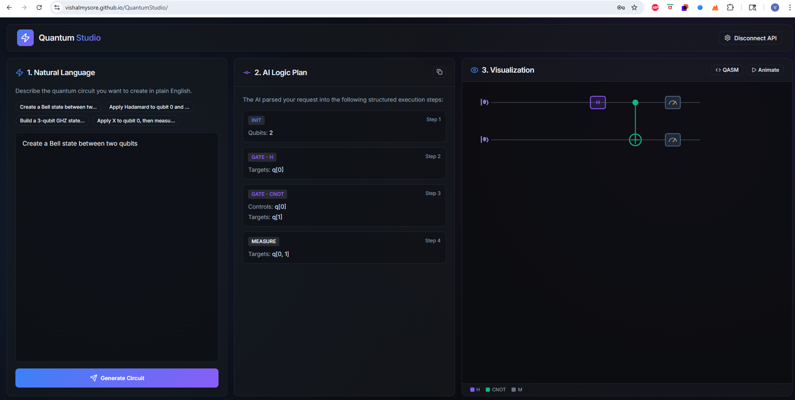

# ⚛️ Quantum Studio

**Quantum Studio** is an AI-powered, browser-based quantum circuit designer. It converts natural language prompts (e.g., *"Create a Bell state and measure it"*) into structured quantum logic and **OpenQASM 2.0** code, visualized with a custom animated canvas renderer.



👉 **[Launch Quantum Studio Live](https://vishalmysore.github.io/QuantumStudio/)**

## 💡 Why Quantum Studio?

I built **Quantum Studio** because I wanted to learn quantum computing in a truly visual and intuitive way. In the next few years, quantum computing will be critical to solving some of our most complex problems, but the barrier to entry is often seen as too high. 

I wanted a laboratory where I could:
1.  **Use Natural Language:** No need to memorize complex syntax first—just talk to the AI.
2.  **Visualize Instantly:** See the logic turn into a circuit diagram in real-time.
3.  **Animate Logic:** Watch exactly how the gates are applied across qubits.
4.  **Export to QASM:** Turn high-level intent into industry-standard code (OpenQASM 2.0).

---

## 🚀 Key Features

- **Natural Language Parsing:** Uses OpenAI-compatible LLMs (like Nvidia NIM Nemotron) to interpret circuit intent.
- **OpenQASM 2.0 Compiler:** Automatically generates standard quantum assembly code.
- **Animated Visualization:** A custom canvas-based circuit diagram with gate-by-gate animation.
- **CORS-Safe Architecture:** Includes a Cloudflare Worker proxy to securely bypass browser CORS restrictions when calling external LLM APIs from the frontend.
- **Privacy First:** API keys are stored only in your local browser's `localStorage`.

## 🛠️ Getting Started

### 1. Online Access (Recommended)
The app is pre-configured with a serverless proxy and ready to use at:
**[https://vishalmysore.github.io/QuantumStudio/](https://vishalmysore.github.io/QuantumStudio/)**

### 2. Local Development
```bash
# Install dependencies
npm install

# Start the dev server
npm run dev
```

## 🔐 Security & Proxying
For production use on GitHub Pages, many APIs (like Nvidia) block direct browser requests via CORS. 

- This repository includes a `cloudflare-worker.js` script to handle secure proxying.
- The live app is pre-configured to use the official **Quantum Studio Proxy** for seamless access.

## 📜 License
This project is licensed under the **MIT License**. See the `LICENSE` file for details.

---
Built with ❤️ by Vishal Mysore for the Quantum AI community.
